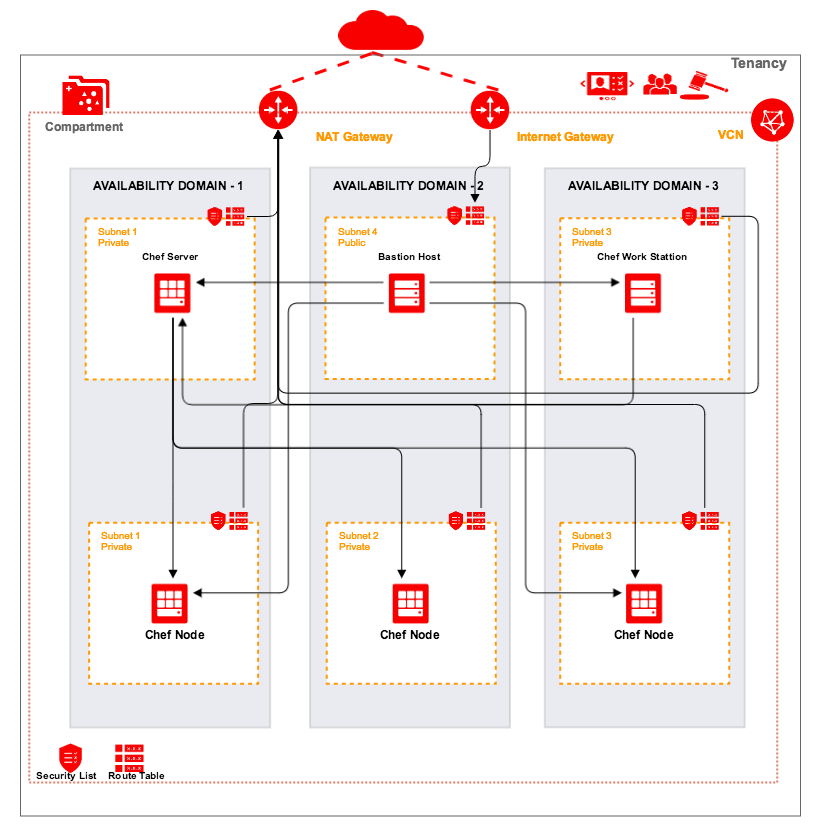

# Existing Infra
## About
- Use terraform-oci-chef module to deploy Chef Sever & Workstation
- Create three Chef Nodes by default
- Upload example_webserver cookbook from Chef Workstation
- Run recipes [example_webserver::default] on Chef Nodes
 
This configuration generally implements this:


### Using this example
Copy terraform.tfvars.template to terraform.tfvars and update required information.

### Deploy  
Initialize Terraform:
```bash
terraform init
```
View what Terraform plans do before actually doing it:
```bash
terraform plan -var 'chef_user_password=yourPassword'
```
Use Terraform to Provision resources and Jenkins cluster on OCI:
```bash
terraform apply -var 'chef_user_password=yourPassword'
```